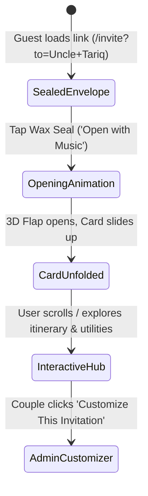

# ✨ Nikkah & Wedding Invitation — Project Documentation

Welcome to the internal engineering and product documentation for the **Nikkah & Digital Wedding Invitation** web experience.

---

## 📖 Table of Contents
1. [Project Overview & Philosophy](#project-overview--philosophy)
2. [Visual Design System & Tokens](#visual-design-system--tokens)
3. [Architecture & Component Tree](#architecture--component-tree)
4. [User Flow & State Lifecycle](#user-flow--state-lifecycle)
5. [Audio & Sound Engineering](#audio--sound-engineering)
6. [Dynamic URL Personalization & Guest System](#dynamic-url-personalization--guest-system)
7. [Admin Customizer & WhatsApp Link Generator](#admin-customizer--whatsapp-link-generator)
8. [Phased Development Roadmap](#phased-development-roadmap)

---

## 1. Project Overview & Philosophy
- **Goal:** Create a high-couture digital wedding invitation that matches the physical prestige of luxury foil-stamped stationery while leveraging interactive web capabilities (3D physics, cinematic envelope unsealing, spatial audio, live countdown, directions, and instant RSVP).
- **Core Principle:** **Mobile-First Luxury**. 95%+ of guests will open their invitation via WhatsApp on mobile devices (iPhone/Android). The entire touch interaction, viewport scaling, and 60fps animations are optimized for mobile viewports while presenting a regal framed experience on desktop.

---

## 2. Visual Design System & Tokens

### Flagship Theme: *Royal Andalusian & Gold Foil*
- **Primary Color:** Deep Royal Emerald (`#04120d`, `#072218`, `#0d3829`)
- **Accent Color:** Radiant Gold Foil (`#faeed1`, `#f3e0a6`, `#d4af37`, `#aa841e`, `#7e5f12`)
- **Parchment Surface:** Warm Hand-pressed Paper (`#fcfbf7`, `#f7f4ec`, `#efe9dc`)
- **Typography:**
  - **Headings & Serif:** *Cinzel*, *Cinzel Decorative*, *Playfair Display*
  - **Script Accents:** *Great Vibes*
  - **Arabic Calligraphy:** *Amiri*
  - **Body / Utility:** *Montserrat*

---

## 3. Architecture & Component Tree

```
src/
├── assets/
│   ├── audio/              # Curated royalty-free ambient wedding tracks
│   └── textures/           # Subtle paper texture and gold foil patterns
├── components/
│   ├── cover/
│   │   ├── EnvelopeCover.tsx    # 3D Envelope with dynamic wax seal & monogram
│   │   ├── WaxSeal.tsx          # Interactive wax seal with breaking & particle effect
│   │   └── AudioConsentModal.tsx # Classy 'Enter with Music' gate
│   ├── card/
│   │   ├── InvitationCard.tsx   # Unfolded gilded invitation card
│   │   ├── SpiritualHeader.tsx  # Bismillah & Quranic Verse (Surah Ar-Rum 30:21)
│   │   ├── CoupleSection.tsx    # Bride & Groom names + Parents' blessings
│   │   ├── EventSchedule.tsx    # Nikkah ceremony & reception details
│   │   └── UtilityHub.tsx       # Live countdown, Google Maps, Add to Calendar
│   ├── audio/
│   │   ├── AudioPlayer.tsx      # Global ambient music manager with volume fade
│   │   └── TrackSwitcher.tsx    # Floating track preview switcher
│   ├── customizer/
│   │   ├── AdminDrawer.tsx      # Slide-over customizer for wedding details
│   │   └── WhatsAppGenerator.tsx# Generates 1-click personalized guest invite links
│   └── ui/
│       ├── IslamicArch.tsx      # SVG Andalusian arch frames & borders
│       ├── ParticleCanvas.tsx   # Subtle floating gold dust particles
│       └── GoldButton.tsx       # Reusable luxury gilded button
├── config/
│   ├── weddingConfig.ts    # Default wedding configuration & sample data
│   └── audioTracks.ts      # Audio playlist configuration
├── types/
│   └── invitation.ts       # TypeScript interfaces for wedding & guest models
├── utils/
│   ├── calendar.ts         # .ics and Google/Apple calendar deep links
│   └── urlHelper.ts        # Query parameter parser & serializer (?to=Guest+Name)
├── App.tsx                 # Main application controller
└── index.css               # Tailwind v4 theme tokens & keyframes
```

---

## 4. User Flow & State Lifecycle



---

## 5. Audio & Sound Engineering
- Uses **Howler.js** to manage HTML5 Audio and Web Audio API.
- Solves browser autoplay restrictions gracefully by using the unsealing tap as the user interaction hook.
- Features smooth volume easing (fade-in on unseal, fade-out on pause/switch).

---

## 6. Dynamic URL Personalization
- **Structure:** `https://your-domain.com/?to=Honored+Guest+Name`
- The name is extracted on mount and dynamically rendered on:
  1. The outer envelope pocket tag (*"Specially prepared for [Guest Name]"*).
  2. The inner invitation header greeting (*"Dear [Guest Name], we cordially invite you..."*).

---

## 7. Phased Development Roadmap

- [x] **Phase 1.1:** Vite + Tailwind v4 + TypeScript + Framer Motion scaffolding.
- [ ] **Phase 1.2:** Flagship Royal Andalusian envelope unboxing & 3D card unfold.
- [ ] **Phase 1.3:** Spiritual header, couple typography, event itinerary & countdown.
- [ ] **Phase 1.4:** Interactive utility hub (Add to Calendar, Google Maps, Confetti celebration).
- [ ] **Phase 1.5:** Audio engine with live track switcher.
- [ ] **Phase 1.6:** Admin customizer drawer & 1-tap WhatsApp link generator.
- [ ] **Phase 2.0:** Multi-template selection (Minimalist Atelier, Botanical Oasis) & backend integration.
